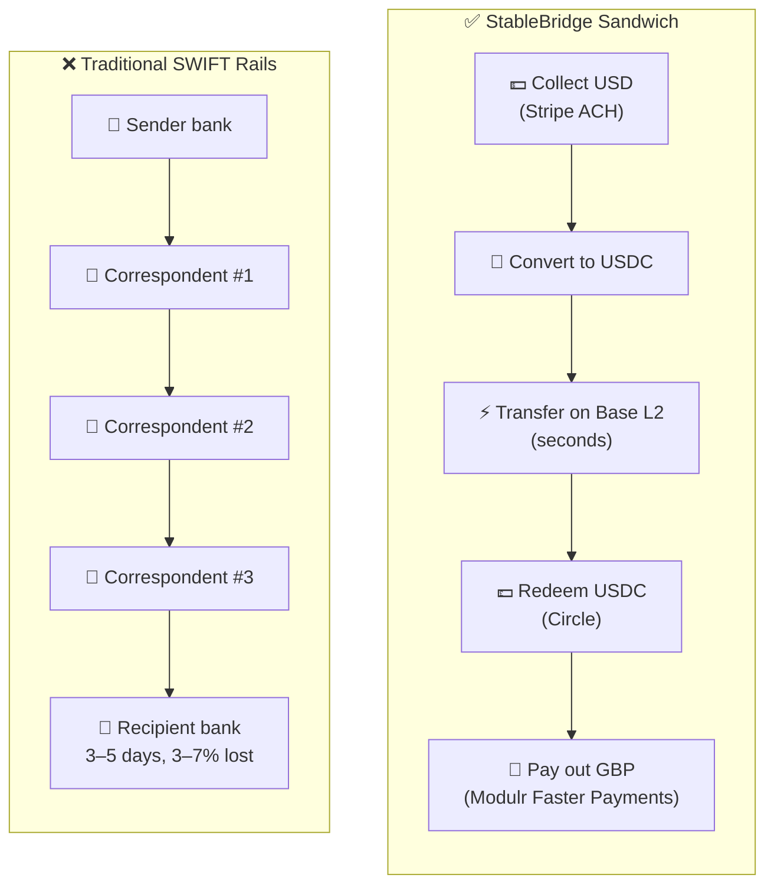
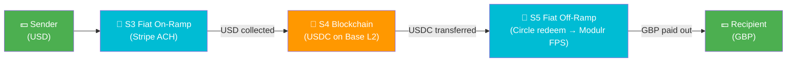
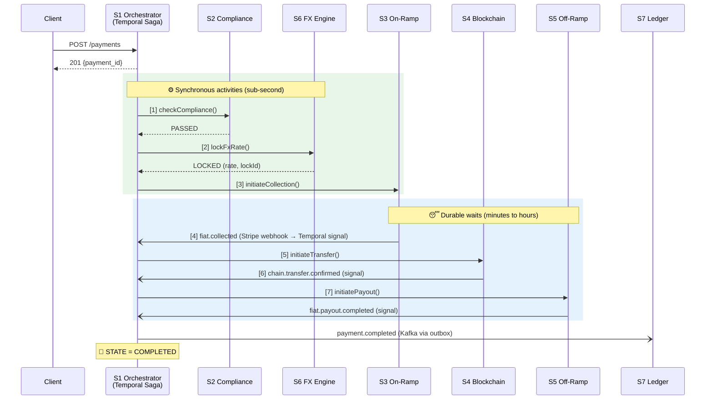
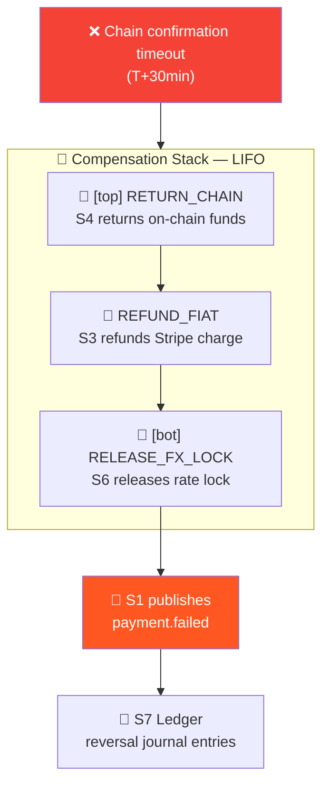
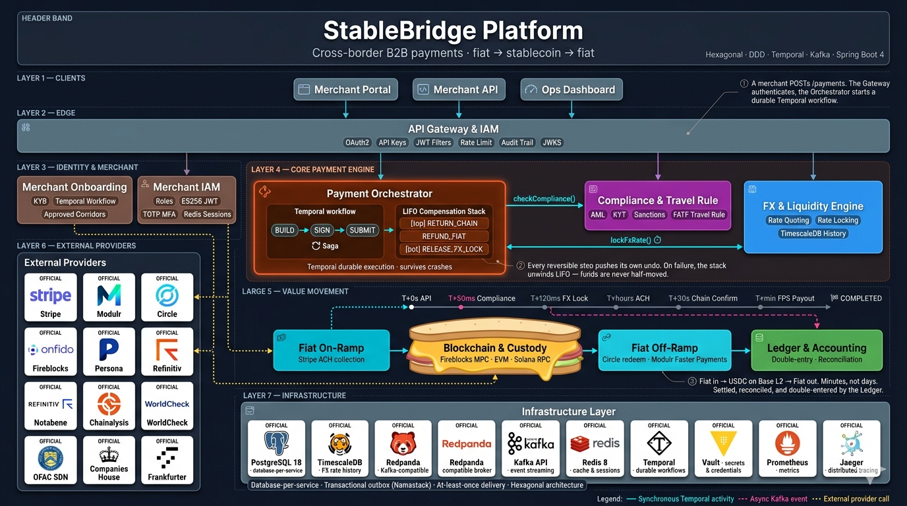
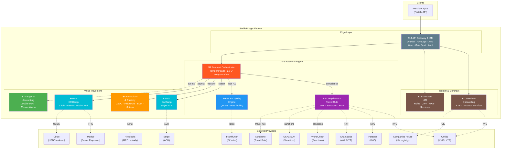

<div align="center">

# StableBridge Platform

**Enterprise-grade cross-border B2B payments using a fiat → stablecoin → fiat "sandwich".** Ten microservices orchestrated with Temporal sagas, backed by Kafka event streams and PostgreSQL-per-service — moving real money through Stripe ACH, Base L2 USDC, and Modulr Faster Payments.

[](https://github.com/Puneethkumarck/stablebridge-platform/actions/workflows/ci.yml)


[Why Stablecoin Rails?](#why-stablecoin-rails) · [The Sandwich Flow](#the-sandwich-flow) · [How a Payment Moves](#how-a-payment-moves) · [Architecture](#architecture) · [Getting Started](#getting-started)

</div>

---

## The Problem

Cross-border B2B payments take **2–5 business days**, lose **3–7% to FX spreads and intermediary fees**, and give you **zero visibility** between "submitted" and "landed." Every correspondent banking hop is a SWIFT message, a cut-off window, and a reconciliation headache.

## The Solution

StableBridge replaces the SWIFT rails with a **fiat → USDC → fiat sandwich**: collect fiat from the sender, convert to USDC on-chain, bridge across borders in seconds, then redeem to the recipient's local currency. A Temporal saga orchestrates the entire lifecycle with LIFO compensation on failure — every step is crash-proof, observable, and reversible.

## The Result

A production-shaped payment platform where a **USD → GBP transfer clears in minutes**, every state transition is traceable across ten services, and the failure modes that break traditional rails (stuck wires, silent reject codes, manual reconciliation) are modelled as first-class saga states.

<div align="center">

| What | How |
|------|-----|
| **Services** | 10 hexagonal microservices (DDD + CQRS) |
| **Orchestration** | Temporal workflows with LIFO saga compensation |
| **Event Delivery** | Transactional outbox (Namastack) + Kafka |
| **External Adapters** | Real provider integrations — Stripe · Modulr · Circle · Fireblocks · Onfido · Persona · Chainalysis · Companies House · Notabene · WorldCheck · OFAC SDN · Frankfurter · Refinitiv |
| **Sandbox Adapter Tests** | Real API calls into provider sandboxes behind `make sandbox-test` |
| **Sandbox-verified Corridor** | US → UK (USD → GBP) via Stripe ACH · USDC on Base L2 · Modulr Faster Payments |
| **Additional rails** | Modulr SEPA (EUR) — code-complete, not sandbox-verified |

</div>

---

## Table of Contents

- [Why Stablecoin Rails?](#why-stablecoin-rails)
- [The Sandwich Flow](#the-sandwich-flow)
- [How a Payment Moves](#how-a-payment-moves)
- [Saga &amp; Compensation](#saga--compensation)
- [Architecture](#architecture)
  - [System Architecture](#system-architecture)
  - [Hexagonal Layer Design](#hexagonal-layer-design)
  - [Event-Driven Flow](#event-driven-flow)
- [Services](#services)
- [External Provider Adapters](#external-provider-adapters)
- [Tech Stack](#tech-stack)
- [Project Structure](#project-structure)
- [Testing Strategy](#testing-strategy)
- [Getting Started](#getting-started)
- [Local Infrastructure](#local-infrastructure)
- [CI/CD Pipeline](#cicd-pipeline)
- [Contributing](#contributing)
- [License](#license)

---

## Why Stablecoin Rails?

Traditional correspondent banking is a relay race between banks that don't trust each other. Every hop adds latency, cost, and a new failure mode.

> **🎬 A Day in the Life of a SWIFT Transfer**

```text
 🏢 Sender Bank (NYC)  ──→  "MT103 for $10,000 → London"
 📨 Correspondent #1   ──→  "Received, holding 24h for compliance"
 📨 Correspondent #2   ──→  "FX'd at internal rate + 2.5%"
 📨 Correspondent #3   ──→  "Cut-off missed — retry Monday"

                            ⏳ ... 3 business days later ...

 🏢 Recipient Bank     ──→  "Funds landed. Minus $85 in fees."
 📉 Sender             ──→  "Was it 7,550 or 7,600 GBP? Ask ops."
 😤 Ops Team           ──→  "Manual reconciliation, 40 minutes per wire"
```

### What Goes Wrong

| | Failure Mode | What Happens | Severity |
|---|---|---|---|
| ⏱️ | **Cut-off windows** | Submit at 4:01pm → wait until tomorrow | 🟠 Predictable delay |
| 💸 | **Opaque FX spread** | "Mid-market + 2.5%" applied at each hop | 🔴 Silent fee drain |
| 🕳️ | **Intermediary holds** | Correspondent holds 24h for "compliance" | 🟠 No callback |
| 🔇 | **Silent rejects** | MT103 rejected → bounces through the chain | 🔴 Lost for days |
| 🧾 | **Manual reconciliation** | "Was this the Acme wire?" → 40 min of spreadsheet work | 🔴 Doesn't scale |

### What Stablecoin Rails Replace



---

## The Sandwich Flow

The name says it: **fiat bread, stablecoin filling**. Three phases, two value transformations, one atomic saga.

```text
 ┌───────────────────────────────────────────────────────────────────────────┐
 │                                                                           │
 │   🥪  THE STABLECOIN SANDWICH                                             │
 │                                                                           │
 │   💵 Sender USD          🔗 USDC on Base L2          💷 Recipient GBP    │
 │   ──────────────         ─────────────────           ──────────────      │
 │        │                         │                         ▲            │
 │        │    [S3 On-Ramp]         │    [S5 Off-Ramp]       │            │
 │        ▼                         ▼                         │            │
 │   ┌────────┐    mint    ┌───────────────┐    redeem   ┌────────┐       │
 │   │ Stripe │ ─────────► │ USDC transfer │ ──────────► │ Circle │       │
 │   │  ACH   │            │   on Base L2  │             │ + Modulr│      │
 │   └────────┘            └───────────────┘             └────────┘       │
 │                                                                           │
 │   ⏱️ Hours (ACH)          ⚡ ~1 block finality        ⏱️ FPS near-instant │
 │                                                                           │
 │   🧠 All orchestrated by S1 Payment Orchestrator (Temporal saga)         │
 │   🧾 Every state change double-entered by S7 Ledger                      │
 │   🛡️ Every transfer screened by S2 Compliance (AML/KYT/Travel Rule)     │
 │                                                                           │
 └───────────────────────────────────────────────────────────────────────────┘
```



> **📌 Sandbox-verified corridor:** `US → UK`, `USD → GBP`. The first end-to-end payment that actually cleared through all seven value-movement services was a `$5.00 USD → £3.73 GBP` transfer against the real Modulr sandbox (GBP Faster Payments · SCAN destination). The Modulr sandbox is GBP-only — the adapter's SEPA/EUR code path is exercised by [`Phase3PaymentE2ETest`](phase3-integration-tests/src/test/java/com/stablecoin/payments/phase3/Phase3PaymentE2ETest.java) against WireMock stubs but has not been verified against a live Modulr EU account.

---

## How a Payment Moves

A `POST /payments` doesn't just return 201 — it starts a **Temporal workflow** that carries the request through seven services, sleeps durably while waiting on ACH, wakes on webhook signals, and can unwind its own compensation stack if anything fails.

> **🎬 The Seven-Stage Journey**

```text
 ⏱️ T+0s       📤 Client  →  POST /payments
               🚀 S1 starts PaymentWorkflow (Temporal)

 ⏱️ T+50ms     [1] 🛡️  Compliance check  (S2)  ─── sync activity
                  ✅ PASSED — screened against OFAC, Chainalysis, Notabene

 ⏱️ T+120ms    [2] 💱  Lock FX rate      (S6)  ─── sync activity
                  ✅ LOCKED — USD→GBP rate held for 5 minutes

 ⏱️ T+180ms    [3] 💵  Initiate collect  (S3)  ─── sync activity
                  ⏳ Stripe ACH in flight — workflow sleeps durably

 ⏱️ T+hours    [4] 📨  Stripe webhook arrives  →  signal: fiatCollected
                  🔓 Workflow wakes up automatically

 ⏱️ T+1s       [5] 🔗  Initiate transfer (S4)  ─── sync activity
                  🏗️ Fireblocks MPC signs → broadcast USDC on Base L2
                  ⏳ Workflow sleeps again, waiting for chain confirmation

 ⏱️ T+~30s     [6] 📡  chain.confirmed signal  →  workflow wakes
                  ✅ USDC landed on recipient wallet

 ⏱️ T+2s       [7] 💷  Initiate payout   (S5)  ─── sync activity
                  🏦 Circle redeems USDC → Modulr Faster Payments payout
                  ⏳ Wait for fiat.payout.completed signal

 ⏱️ T+minutes  📨  payout.completed signal  →  workflow wakes
                  🏁 STATE = COMPLETED
                  📢 S1 publishes payment.completed → S7 Ledger posts journal
```



**Why Temporal?** A payment lifecycle can span **hours** (ACH settlement) and must survive process restarts, deploys, and crashes. Temporal provides **durable execution** — the workflow code reads like sequential Java, but state is persisted between every step. If the worker process dies at T+10 minutes, a new worker picks up at T+10 minutes, not T+0.

| Temporal Feature | Used By |
|---|---|
| **Workflows** | [`PaymentWorkflowImpl`](payment-orchestrator/payment-orchestrator/src/main/java/com/stablecoin/payments/orchestrator/domain/workflow/PaymentWorkflowImpl.java), [`MerchantOnboardingWorkflowImpl`](merchant-onboarding/merchant-onboarding/src/main/java/com/stablecoin/payments/merchant/onboarding/infrastructure/temporal/workflow/MerchantOnboardingWorkflowImpl.java) |
| **Activities** | `ComplianceCheckActivity`, `FxLockActivity`, `FiatCollectionActivity`, `ChainTransferActivity`, `OffRampActivity`, `UpdatePaymentStateActivity`, `EventPublishingActivity` |
| **Signals** | `FiatCollectedSignal`, `ChainConfirmedSignal`, `CancelRequest` — external webhook arrivals routed into a running workflow |
| **Retry policy** | Per-activity exponential backoff with a non-retryable exception list (e.g. `SANCTIONS_HIT`, `CORRIDOR_NOT_SUPPORTED`, `INSUFFICIENT_LIQUIDITY`, `PSP_REJECTED`, `INSUFFICIENT_BALANCE`) |
| **Durable timers** | `FIAT_COLLECTION_TIMEOUT = 30 min`, `CHAIN_CONFIRMATION_TIMEOUT = 30 min` |

---

## Saga &amp; Compensation

The hardest thing about multi-step financial workflows isn't the happy path — it's what happens when **step 6 fails after steps 1–5 have already moved real money**. StableBridge uses a **LIFO compensation stack**: every step that performs a reversible side-effect pushes its own undo onto the stack. If anything fails afterwards, the stack unwinds in reverse order.

> **🎬 Failure Scenario: Chain transfer fails after fiat was collected**

```text
 ⏱️ T+0s     ✅  Compliance passed             ← no compensation needed
 ⏱️ T+1s     ✅  FX lock acquired              ← push RELEASE_FX_LOCK
 ⏱️ T+hours  ✅  Fiat collected via Stripe     ← push REFUND_FIAT
 ⏱️ T+1s     ✅  Chain transfer broadcast      ← push RETURN_CHAIN
 ⏱️ T+30min  ❌  Chain confirmation TIMEOUT

             ┌─ COMPENSATION STACK (LIFO) ──┐
             │  [top]  RETURN_CHAIN         │  ← ArrayDeque.pop()
             │         REFUND_FIAT          │
             │  [bot]  RELEASE_FX_LOCK      │
             └──────────────────────────────┘

 ⏱️ T+31min  🔄  Pop RETURN_CHAIN   → S4 returns funds on-chain
 ⏱️ T+32min  🔄  Pop REFUND_FIAT    → S3 refunds Stripe charge
 ⏱️ T+33min  🔄  Pop RELEASE_FX_LOCK → S6 releases the rate lock
 ⏱️ T+34min  📢  Publish payment.failed → S7 Ledger writes reversal entries
             🏁  STATE = FAILED (clean)
```



**Where it lives:** [`PaymentWorkflowImpl.java`](payment-orchestrator/payment-orchestrator/src/main/java/com/stablecoin/payments/orchestrator/domain/workflow/PaymentWorkflowImpl.java) — `private final Deque<String> compensationStack = new ArrayDeque<>()`. Each successful side-effect pushes a step prefix (`RELEASE_FX_LOCK_<id>`, `REFUND_FIAT_<id>`, `RETURN_CHAIN_<id>`) that a single `runCompensation()` method pops and dispatches to the right activity.

**Non-retryable failures** (sanctions hits, unsupported corridors, insufficient liquidity, PSP rejections, insufficient balance) short-circuit retry and head straight into compensation — you don't want to retry a sanctions hit.

---

## Architecture

<p align="center">
  
</p>

<p align="center"><sub>The full enterprise-level view: clients, gateway, identity, payment core with Temporal saga + LIFO compensation, the fiat → USDC → fiat sandwich, external providers (Stripe, Modulr, Circle, Fireblocks, Onfido, Persona, Chainalysis, Notabene, WorldCheck, OFAC SDN, Companies House, Frankfurter, Refinitiv), and the infrastructure layer (PostgreSQL, TimescaleDB, Redpanda, Redis, Temporal, Vault, Prometheus, Jaeger).</sub></p>

StableBridge follows **Hexagonal Architecture (Ports &amp; Adapters)** with DDD tactical patterns, CQRS at the handler boundary, and event-driven propagation via a transactional outbox. Every service is shaped the same way so you can read one and you've read them all.

| Decision | Why |
|---|---|
| **Hexagonal + DDD** | Keeps domain logic free of Spring, JPA, Temporal, and Kafka — swap an adapter without touching a single business rule |
| **Database per service** | Each service owns its schema in its own PostgreSQL database — no shared tables, no cross-service JOINs |
| **Transactional outbox (Namastack)** | Domain state and the outbound event land in the same DB transaction — no dual-write, at-least-once delivery |
| **Temporal sagas** | Durable execution for multi-step flows that span hours and must survive restarts |
| **Controllers → CommandHandlers (direct)** | No intermediate "application service" — the controller is a thin HTTP adapter, the handler owns the use case |
| **ArchUnit enforced** | [`HexagonalArchitectureRules`](platform-test/src/testFixtures/java/com/stablecoin/payments/platform/test/HexagonalArchitectureRules.java) + per-service `ArchitectureTest` classes fail the build if the domain imports JPA |

### System Architecture



> **Solid lines** = synchronous Temporal activities. **Dashed lines** = external provider integrations. Inter-service events flow via Kafka (Redpanda locally) using the Namastack transactional outbox.

### Hexagonal Layer Design

```text
┌──────────────────────────────────────────────────────────────────────┐
│                                                                      │
│   application/  ──────────►  domain/  ◄──────────  infrastructure/  │
│   (Inbound Adapters)         (Core)                (Outbound)       │
│                                                                      │
│   REST Controllers           Aggregates             PostgreSQL JPA  │
│   Temporal Workflows         Value Objects          Kafka (Namastack│
│   Scheduled Jobs             Command Handlers        outbox)         │
│   Security Filters           Domain Events          Feign clients   │
│                              Port interfaces        External adapters│
│                              Domain exceptions      MapStruct maps  │
│                                                                      │
└──────────────────────────────────────────────────────────────────────┘

Rules enforced by ArchUnit (platform-test/HexagonalArchitectureRules):
  ✓ Domain layer has ZERO JPA imports
  ✓ Domain defines port interfaces — infrastructure implements them
  ✓ Controllers live in application.controller — no web/ package
  ✓ Controller → CommandHandler directly — no intermediate service layer
  ✓ No wildcard imports, no System.out, no @Autowired
```

Every service ships its own `ArchitectureTest.java` that re-applies these rules. Merging a domain class that imports `jakarta.persistence.*` fails CI.

### Event-Driven Flow

The transactional outbox pattern is used everywhere state changes need to fan out:

```text
┌──────────────────────────────────────────────────────────────────────┐
│                     TRANSACTION (atomic)                             │
│                                                                      │
│   ┌─────────────┐         ┌──────────────────┐                      │
│   │ Domain      │  save   │  Outbox Event    │                      │
│   │ Aggregate   │────────►│  Table           │                      │
│   │ (PostgreSQL)│         │  (PostgreSQL)    │                      │
│   └─────────────┘         └──────────────────┘                      │
│                                                                      │
└────────────────────────────────────┬─────────────────────────────────┘
                                     │
                          ┌──────────▼──────────┐
                          │ Namastack Relay     │  (scheduled worker)
                          │ Poll → Publish →    │
                          │ Mark sent           │
                          └──────────┬──────────┘
                                     │
                          ┌──────────▼──────────┐
                          │  Kafka (Redpanda)   │
                          │  payment.* / fiat.* │
                          │  chain.* / fx.*     │
                          └─────────────────────┘
```

**Why transactional outbox?** The classic dual-write problem: save to DB → publish to Kafka → crash in between = event lost. Save both the aggregate change and the outbox row in the **same transaction**, then a relay reads the outbox table and publishes at-least-once. The application code never touches a Kafka producer directly.

---

## Services

All ten services are fully implemented, hexagonal, ArchUnit-enforced, and buildable Gradle modules in [`settings.gradle.kts`](settings.gradle.kts).

| # | Service | Responsibility | External Adapters |
|:---:|---|---|---|
| **S1** | [Payment Orchestrator](payment-orchestrator/) | Temporal saga · LIFO compensation · payment state machine | — (orchestration only) |
| **S2** | [Compliance &amp; Travel Rule](compliance-travel-rule/) | KYC · sanctions · AML/KYT · FATF Travel Rule | Onfido · Persona · WorldCheck · OFAC SDN · Chainalysis · Notabene |
| **S3** | [Fiat On-Ramp](fiat-on-ramp/) | ACH collection · webhook relay · refund path | Stripe |
| **S4** | [Blockchain &amp; Custody](blockchain-custody/) | USDC transfers · MPC signing · nonce mgmt · chain selection | Fireblocks · EVM RPC · Solana RPC · local dev (web3j) |
| **S5** | [Fiat Off-Ramp](fiat-off-ramp/) | USDC redemption · Faster Payments (GBP) / SEPA (EUR) payout | Circle · Modulr |
| **S6** | [FX &amp; Liquidity Engine](fx-liquidity-engine/) | Rate quoting with margin · rate locking · history | Frankfurter · Refinitiv · Redis rate cache |
| **S7** | [Ledger &amp; Accounting](ledger-accounting/) | Double-entry bookkeeping · event-sourced reconciliation | — |
| **S10** | [API Gateway &amp; IAM](api-gateway-iam/) | OAuth2 · API key auth · rate limiting · audit filters · JWKS | — |
| **S11** | [Merchant Onboarding](merchant-onboarding/) | KYB verification · onboarding Temporal workflow · approved corridors | Onfido · Companies House |
| **S13** | [Merchant IAM](merchant-iam/) | Roles · permissions · JWT (ES256) · TOTP MFA · Redis sessions | — |

Every service carries its own unit, integration, and business test tiers with ArchUnit rules enforcing hexagonal boundaries. See [Testing Strategy](#testing-strategy) for conventions.

---

## External Provider Adapters

Every external integration sits behind a hexagonal port, with an **ACL DTO** package-private inside `infrastructure/provider/<name>/` and a **sandbox test** that hits the real provider sandbox when credentials are present.

| Provider | Adapter | Sandbox Test | Used By |
|---|---|---|---|
| **Stripe** | `StripePspAdapter` | [`StripeAdapterSandboxTest`](fiat-on-ramp/fiat-on-ramp/src/test/java/com/stablecoin/payments/onramp/infrastructure/provider/stripe/StripeAdapterSandboxTest.java) | S3 |
| **Modulr** | `ModulrPayoutAdapter` | [`ModulrPayoutAdapterSandboxTest`](fiat-off-ramp/fiat-off-ramp/src/test/java/com/stablecoin/payments/offramp/infrastructure/provider/modulr/ModulrPayoutAdapterSandboxTest.java) | S5 |
| **Circle** | `CircleRedemptionAdapter` | [`CircleRedemptionAdapterSandboxTest`](fiat-off-ramp/fiat-off-ramp/src/test/java/com/stablecoin/payments/offramp/infrastructure/provider/circle/CircleRedemptionAdapterSandboxTest.java) | S5 |
| **Fireblocks** | `FireblocksCustodyAdapter` (RS256 JWT) | [`FireblocksCustodyAdapterSandboxTest`](blockchain-custody/blockchain-custody/src/test/java/com/stablecoin/payments/custody/infrastructure/provider/fireblocks/FireblocksCustodyAdapterSandboxTest.java) | S4 |
| **EVM RPC** | `EvmRpcAdapter` (Base, Ethereum) | [`EvmRpcAdapterSandboxTest`](blockchain-custody/blockchain-custody/src/test/java/com/stablecoin/payments/custody/infrastructure/provider/evm/EvmRpcAdapterSandboxTest.java) | S4 |
| **Solana RPC** | `SolanaRpcAdapter` | [`SolanaRpcAdapterSandboxTest`](blockchain-custody/blockchain-custody/src/test/java/com/stablecoin/payments/custody/infrastructure/provider/solana/SolanaRpcAdapterSandboxTest.java) | S4 |
| **Onfido KYC** | `OnfidoKycAdapter` | [`OnfidoKycAdapterSandboxTest`](compliance-travel-rule/compliance-travel-rule/src/test/java/com/stablecoin/payments/compliance/infrastructure/provider/onfido/OnfidoKycAdapterSandboxTest.java) | S2 |
| **Onfido KYB** | `OnfidoKybAdapter` | [`OnfidoKybAdapterSandboxTest`](merchant-onboarding/merchant-onboarding/src/test/java/com/stablecoin/payments/merchant/onboarding/infrastructure/kyb/OnfidoKybAdapterSandboxTest.java) | S11 |
| **Persona** | `PersonaKycAdapter` | — | S2 |
| **WorldCheck** | `WorldCheckSanctionsAdapter` | — | S2 |
| **OFAC SDN** | `OfacSdnSanctionsAdapter` | — | S2 |
| **Chainalysis** | `ChainalysisAmlAdapter` | — | S2 |
| **Notabene** | `NotabeneTravelRuleAdapter` | — | S2 |
| **Companies House** | `CompaniesHouseAdapter` | [`CompaniesHouseAdapterSandboxTest`](merchant-onboarding/merchant-onboarding/src/test/java/com/stablecoin/payments/merchant/onboarding/infrastructure/kyb/CompaniesHouseAdapterSandboxTest.java) | S11 |
| **Frankfurter** | `FrankfurterRateAdapter` | [`FrankfurterRateAdapterSandboxTest`](fx-liquidity-engine/fx-liquidity-engine/src/test/java/com/stablecoin/payments/fx/infrastructure/provider/frankfurter/FrankfurterRateAdapterSandboxTest.java) | S6 |
| **Refinitiv** | `RefinitivRateAdapter` | — | S6 |

Sandbox tests are triggered by `make sandbox-test` — each reads credentials from `.env.sandbox` and makes real API calls. WireMock stubs the same endpoints for local CI and `@SpringBootTest` scenarios.

---

## Tech Stack

| Component | Technology |
|---|---|
| **Language** | Java 25 (LTS) |
| **Framework** | Spring Boot 4.0.3 · Spring Cloud 2025.1.1 |
| **Build** | Gradle 9.x (Kotlin DSL) with convention plugins in [`buildSrc/`](buildSrc/) |
| **Database** | PostgreSQL 18 (per-service) · TimescaleDB (FX rate history hypertable) |
| **Migrations** | Flyway |
| **Messaging** | Apache Kafka (Redpanda locally) via Spring Cloud Stream |
| **Outbox** | Namastack JDBC (`namastack-outbox-starter-jdbc`) |
| **Workflow Engine** | Temporal (payment orchestrator, merchant onboarding) |
| **Cache / Sessions** | Redis 8 |
| **Resilience** | Resilience4j 2.3.0 |
| **Mapping** | MapStruct 1.6.3 |
| **Auth** | Spring Security · JWT (ES256 via Nimbus) · bcrypt · TOTP MFA |
| **Observability** | Micrometer · Prometheus · OpenTelemetry · Jaeger · Logstash Encoder |
| **Secrets** | HashiCorp Vault (dev mode locally) |
| **Testing** | JUnit 5 · AssertJ · Mockito BDD · Testcontainers · WireMock · ArchUnit |
| **Quality** | Spotless · JaCoCo · ArchUnit · SonarCloud · OWASP Dependency Check |

---

## Project Structure

```text
stablebridge-platform/
├── platform-api/                       # Shared API contracts
├── platform-infra/                     # Shared infra (AbstractOutboxHandler, etc.)
├── platform-test/                      # Shared test utilities + HexagonalArchitectureRules
│
├── payment-orchestrator/               # S1  · Temporal saga
├── compliance-travel-rule/             # S2  · KYC · sanctions · AML · Travel Rule
├── fiat-on-ramp/                       # S3  · Stripe ACH
├── blockchain-custody/                 # S4  · Fireblocks · EVM · Solana
├── fiat-off-ramp/                      # S5  · Circle · Modulr
├── fx-liquidity-engine/                # S6  · FX quoting + TimescaleDB history
├── ledger-accounting/                  # S7  · Double-entry
├── api-gateway-iam/                    # S10 · OAuth2 · API keys · JWT · rate limit
├── merchant-onboarding/                # S11 · KYB · Temporal workflow
├── merchant-iam/                       # S13 · Roles · JWT · MFA
│
├── phase2-integration-tests/           # Saga + load tests (Phase 2 cross-service)
├── phase3-integration-tests/           # Full sandwich E2E (Phase3PaymentE2ETest)
│
├── infra/local/
│   ├── postgres/init.sql               # Multi-database init script
│   └── wiremock/                       # WireMock stubs for provider sandboxes
│
├── buildSrc/                           # Gradle convention plugins
├── docker-compose.dev.yml              # Local development stack
├── docker-compose.phase2-test.yml      # Phase 2 cross-service test stack
├── docker-compose.phase3-test.yml      # Phase 3 E2E test stack
├── docker-compose.sandbox.yml          # Real provider sandbox stack
├── Makefile                            # Build, test, infra, and sandbox shortcuts
├── build.gradle.kts                    # Root build config
└── settings.gradle.kts                 # Multi-module settings
```

<details>
<summary><b>Per-service module layout (tri-module hexagonal)</b></summary>

Each service ships three Gradle modules:

```text
<service>/
├── <service>-api/        # Request/response DTOs (java-library, shared contract)
├── <service>-client/     # Feign client for inter-service calls (java-library)
└── <service>/            # Spring Boot application
    └── src/
        ├── main/java/com/stablecoin/payments/<service>/
        │   ├── application/controller/   # Thin REST controllers (no web/ package)
        │   ├── domain/
        │   │   ├── model/                # Aggregates, value objects, enums
        │   │   ├── port/                 # Inbound + outbound port interfaces
        │   │   └── service/              # Command handlers (business logic)
        │   └── infrastructure/
        │       ├── persistence/          # JPA entities + *PersistenceAdapter
        │       ├── provider/<name>/      # External provider adapters + ACL DTOs
        │       └── config/               # Spring configuration
        ├── test/java                     # Unit tests + ArchitectureTest
        ├── integration-test/java         # Testcontainers integration tests
        ├── business-test/java            # End-to-end business scenarios
        └── testFixtures/java             # Shared fixtures + TestUtils
```

</details>

---

## Testing Strategy

```text
                    ┌───────────────────────┐
                    │   Business Tests      │   End-to-end scenarios
                    │  (Testcontainers)     │   src/business-test/
                    ├───────────────────────┤
                    │  Integration Tests    │   DB, Kafka, REST
                    │  (Testcontainers)     │   src/integration-test/
                    ├───────────────────────┤
                    │  Architecture Tests   │   ArchUnit rules
                    │  (ArchitectureTest)   │   src/test/
                ┌───┴───────────────────────┴───┐
                │        Unit Tests             │   Domain + handlers + mappers
                │  Mockito BDD + AssertJ         │   src/test/
                └────────────────────────────────┘
```

**Enforced conventions** (see [`docs/TESTING_STANDARDS.md`](docs/TESTING_STANDARDS.md)):

- Single-assert pattern — build expected object, one `usingRecursiveComparison()`
- BDD Mockito only: `given()` / `then()`, never `when()` / `verify()`
- No generic matchers (`any()`, `anyString()`, `eq()`) — use actual values
- `eqIgnoringTimestamps` / `eqIgnoring` from the per-service `TestUtils`
- Test fixtures live in `src/testFixtures/java/.../fixtures/`

```bash
make test                  # Unit + integration + business across every service
make test-unit             # Unit tests only
make test-integration      # Integration tests (requires Docker infra)
make test-business         # Business tests (requires Docker infra)
make test-merchant-iam-all # All tiers for one service
```

**Quality gates** enforced in CI: Spotless · JaCoCo (XML → SonarCloud) · ArchUnit rules · OWASP Dependency Check (`failBuildOnCVSS=7.0`).

---

## Getting Started

### Prerequisites

- **Java 25** (Temurin recommended)
- **Docker 24+** with Compose v2
- **Make** (optional — every target maps to a Gradle command)

### Quick Start

```bash
# 1. Clone
git clone https://github.com/Puneethkumarck/stablebridge-platform.git
cd stablebridge-platform

# 2. Start local infrastructure (Postgres, Redis, Redpanda, Temporal, Vault, …)
make infra-up

# 3. Build all modules
make build

# 4. Run tests (unit + integration + business across all services)
make test

# 5. Run a service locally
make run-merchant-onboarding
```

<details>
<summary><b>Full Make target reference</b></summary>

Run `make help` for the authoritative list. Highlights:

| Target | What it does |
|---|---|
| `make build` | Build all modules (skip tests) |
| `make build-<service>` | Build a single service |
| `make test` | Unit + integration + business across every service |
| `make test-unit` / `test-integration` / `test-business` | Run a single tier |
| `make test-<service>-all` | All tiers for one service |
| `make format` / `make lint` | Spotless apply / check |
| `make check` | Full CI-equivalent check (excludes phase2/3 E2E) |
| `make infra-up` / `infra-down` / `infra-destroy` | Docker Compose lifecycle |
| `make infra-logs` / `infra-logs-<container>` | Tail logs |
| `make db-psql` | Open `psql` shell |
| `make topics` | List Redpanda topics |
| `make run-<service>` | `bootRun` with dev profile |
| `make e2e-up` / `e2e-test` | Phase 3 E2E stack + cross-service test |
| `make sandbox-up` / `sandbox-test` | Real provider sandbox stack + adapter tests |

</details>

---

## Local Infrastructure

A single `docker compose -f docker-compose.dev.yml up -d` brings up **every external dependency** a developer needs — no cloud accounts, no API keys.

| Service | Image | Port(s) | Purpose |
|---|---|---|---|
| PostgreSQL | `postgres:18-alpine` | `5432` | Per-service databases via `infra/local/postgres/init.sql` |
| TimescaleDB | `timescale/timescaledb:latest-pg17` | `5433` | FX rate history hypertable (S6) |
| Redis | `redis:8-alpine` | `6379` | Rate cache · sessions · rate limit counters |
| Redpanda | `redpandadata/redpanda` | `9092` | Kafka-compatible event streaming |
| Redpanda Console | `redpandadata/console` | `9090` | Topic browser |
| Elasticsearch | `elasticsearch:9.3.1` | `9200` | Search (reserved for future use) |
| Temporal | `temporalio/auto-setup` | `7233` | Workflow server (S1 &amp; S11) |
| Temporal UI | `temporalio/ui` | `8233` | Workflow visualization |
| Vault | `hashicorp/vault` | `8200` | Secrets (dev mode, token `dev-root-token`) |
| Mailpit | `axllent/mailpit` | `1025` / `8025` | SMTP sink + web UI |
| WireMock | `wiremock/wiremock` | `4444` | Provider sandboxes (stubs in `infra/local/wiremock/`) |
| Jaeger | `jaegertracing/all-in-one:1.76.0` | `16686` / `4317` / `4318` | Distributed tracing UI + OTLP |
| Prometheus | `prom/prometheus:v3.4.0` | `9091` | Metrics scrape |
| Alertmanager | `prom/alertmanager:v0.28.1` | `9093` | Alert routing |

```bash
docker compose -f docker-compose.dev.yml up -d    # Start
docker compose -f docker-compose.dev.yml ps       # Status
make infra-logs                                   # Tail everything
make infra-destroy                                # Stop + wipe volumes
```

**Real sandbox mode.** `make sandbox-up` uses [`docker-compose.sandbox.yml`](docker-compose.sandbox.yml) with real provider credentials pulled from `.env.sandbox` — Stripe, Alchemy, Circle, Modulr, Fireblocks, Onfido, Persona, Companies House. The `sandbox-tunnel` target starts `cloudflared` so Stripe webhooks reach the local on-ramp service.

---

## CI/CD Pipeline

GitHub Actions workflow [`ci.yml`](.github/workflows/ci.yml):

```text
  ┌──────────┐     ┌──────────┐
  │ spotless │     │ changes  │   (dorny/paths-filter scopes the matrix)
  │  check   │     │ detector │
  └────┬─────┘     └────┬─────┘
       │                │
       └────────┬───────┘
                ▼
        ┌───────────────┐
        │      test     │   Matrix: one job per changed service
        │  (per service)│   ./gradlew :<svc>:test :<svc>:jacocoTestReport
        └───────┬───────┘            :<svc>:integrationTest :<svc>:businessTest
                │
        ┌───────┴───────┐
        ▼               ▼
  ┌──────────┐    ┌──────────┐
  │ci-status │    │  sonar   │   (SonarCloud, push only)
  └──────────┘    └──────────┘
```

- **Java:** 25 Temurin for build + tests; falls back to JDK 21 for SonarCloud (BouncyCastle MRJar compatibility)
- **Testcontainers reuse:** `TESTCONTAINERS_REUSE_ENABLE=true` for faster reruns
- **Scope-aware:** `changes` job uses path filters so only touched services run the full matrix
- **Additional workflows:** [`security-scan.yml`](.github/workflows/security-scan.yml), [`coderabbit-autofix.yml`](.github/workflows/coderabbit-autofix.yml), [`claude.yml`](.github/workflows/claude.yml), [`stale.yml`](.github/workflows/stale.yml)

---

## Contributing

1. **Fork** the repository
2. **Create a feature branch** — `feature/STA-<id>-<short-description>`
3. **Read** [`docs/CODING_STANDARDS.md`](docs/CODING_STANDARDS.md) and [`docs/TESTING_STANDARDS.md`](docs/TESTING_STANDARDS.md) before writing code
4. **Run** `make ci` locally before pushing
5. **Open a PR** against `main` with `Closes STA-<id>` in the body

<details>
<summary><b>Style rules always applied</b></summary>

- No comments or Javadoc — code must be self-documenting
- No `@Autowired` — use `@RequiredArgsConstructor` with `private final` fields
- No `System.out` / `System.err` — use `@Slf4j`
- No wildcard imports — every import explicit
- `var` for local variables when the type is obvious
- AssertJ only — no JUnit `assertEquals` / `assertTrue`
- BDD Mockito only — `given()` / `then()`, never `when()` / `verify()`
- No generic matchers — use actual values or the `eqIgnoringTimestamps` helper
- Controllers live in `application.controller` — no `web/` package
- Controller → CommandHandler directly — no intermediate service layer
- Single-assert test pattern: build expected object → one `usingRecursiveComparison()`

</details>

---

## Security

If you discover a security vulnerability, please **do not** open a public issue. Report it privately via [GitHub Security Advisories](https://github.com/Puneethkumarck/stablebridge-platform/security/advisories/new).

---

## License

MIT — see [LICENSE](LICENSE).

---

<div align="center">
  <sub>Built with Java 25 · Spring Boot 4 · Temporal · Kafka · Base L2</sub>
</div>
